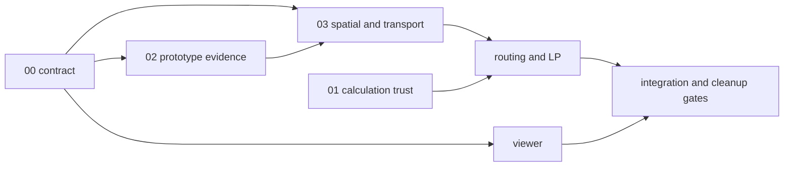

# Blueprint routing contract 1.1.1 (task 00, amended)

Status: frozen development interface, written before routing implementation.
Version 1.1.0 amends 1.0.0 with unsupported-subsystem scoping and declared mods,
and 1.1.1 lets a `feasible` objective carry infeasibility scenarios (see the
"changes" sections below); the public import surface only grew.
Starting snapshot: `0b0f3da6499fcea21e100fec494c54e7dc979b01` plus the existing
uncommitted planner/MCP/skill work. This contract adds no public tool and changes
no legacy calculation. Synthetic data below is schema and interaction test data,
not a measurement or a solver result for the player's factory.

## Ownership and dependencies

One choice: `blueprint_contract.py` owns all immutable spatial/request types,
serialization, hashing and cross-reference validation; `findings.py` imports those
types and owns findings, bounds, result and result validation. There is no parallel
schema in `spatial.py` or the LP. Task 00 also owns `test_blueprint_contract.py`,
`tests/fixtures/routing_contracts/` and this document. Shared changes require a
concrete versioned proposal. Task 01 alone owns legacy calculation fixes.



Exact imports (Python 3.10+, standard library only):

```python
from factoribot.blueprint_contract import (
    SCHEMA_VERSION, MECHANICS_PROFILE, ContractError, EntityId, EndpointId,
    Material, Capacity, JsonDocument, Evidence, Entity, Port, Lane, Inventory,
    Eligibility, ResourceUse, CapacityGroup, Arc, Activity, SpatialGraph,
    RoutingRequest, FurnaceAssignment, AssignmentSet, DetailScope,
    canonical_json, content_hash, to_dict, parse_graph, parse_request,
    parse_assignments, validate_request, unresolved_reasons,
    # added in 1.1.0
    Subsystem, SUBSYSTEMS, ITEM_SUBSYSTEMS, IRRELEVANCE_BASES, BASE_MOD,
    ModDeclaration, IrrelevanceDeclaration, declared_assumptions, declared_irrelevant,
)
from factoribot.findings import (
    Finding, BoundScenario, AnalysisResult, parse_result, validate_result,
    finding_id, comparison_hash,
)
```

API signatures are `parse_graph(value: dict) -> SpatialGraph`,
`parse_request(value: dict, graph: SpatialGraph) -> RoutingRequest`,
`parse_assignments(value: dict, graph: SpatialGraph) -> AssignmentSet`,
`parse_result(value: dict, graph: SpatialGraph) -> AnalysisResult`,
`validate_request(request, graph) -> None`, `validate_result(result, graph) -> None`,
`unresolved_reasons(request, graph) -> tuple[str, ...]` (empty means bounds may be
advertised; this is the single decision function downstream code calls),
`declared_assumptions(request) -> tuple[str, ...]` (audit strings a result must
repeat), `declared_irrelevant(request, graph) -> frozenset[EntityId]`,
`to_dict(value) -> JSON-compatible value`, `content_hash(value) -> str`,
`canonical_json(value) -> str`. `ModVersion` remains as an alias of
`ModDeclaration`. Dataclass fields are the wire field names. All
fields are required (including empty arrays and null alternatives); unknown keys,
coercions, NaN, infinities and unsupported enum options fail with `ContractError`.
Constructors validate local shape; contextual validation uses the graph. Frozen
records contain tuples and immutable JSON documents, never mutable input dicts.
There are no solver or transport implementation stubs.

## Identity, geometry, serialization

`EntityId(book_path: tuple[int, ...], entity_number: int)` uses the full sequence
of **book entry index values**, never array offsets or active-index selection.
The root standalone blueprint has path `[]`; `[2, 7]` is distinct from `[7, 2]`.
Indices are nonnegative integers, entity numbers positive; booleans are invalid.
Duplicate sibling indices and duplicate entities within a leaf are invalid.
Different leaves never connect implicitly, even at identical world coordinates.

`EndpointId(entity, kind, name)` identifies a `port`, `lane`, or `inventory`.
Names use `[a-z][a-z0-9_-]*`; owners must exist. Entity key text is `bp/root/e/1`
or `bp/2/7/e/1`; endpoint keys append `/port/output` etc. JSON identity is the
structured object, not parsing an ad hoc display string. Arc/group/activity IDs
are graph-local name tokens; evidence IDs are name tokens too. Finding IDs are
`finding:` plus SHA-256 of code, sorted entity/endpoint scope, material and sorted
evidence IDs; severity and translated message text do not alter identity.

Positions and footprint boxes use tiles, x east, y south, absolute world
coordinates; retain fractional coordinates without tile rounding. A box has
minimum and maximum corners and positive area. Direction is the Factorio 2.0
16-step clockwise integer convention, north=0, east=4, south=8, west=12.
Orientation is null or a turn fraction in [0,1). Other directions remain visible
but are unsupported by the first transport profile. Lane side is left/right
looking in movement direction. Ports have incoming/outgoing/bidirectional roles;
lanes explicitly join their incoming/outgoing ports. Inventory IDs describe
conserved local material pools, not implicit sources or sinks. Evidence can point
to an ordered graph arc path, endpoints, entities, and RFC 6901 pointers into a
named blueprint/prototype/fixture/observation source.

Lane IDs are aliases, never additional conservation nodes: a feed or arc target
using a lane resolves to its incoming port; an export, surplus or arc source
using a lane resolves to its outgoing port. Activities should use concrete ports
or inventories. A material flow must satisfy eligibility at the arc and both
resolved endpoints; lane references additionally satisfy lane eligibility.

`JsonDocument` stores canonical JSON text and returns a fresh decoded value.
Blueprint documents retain the entire root, including unknown metadata, wires,
tags, tiles, nested books and unused leaves. Prototype documents retain the
versioned adapter input. Canonical algorithm `factoribot-json-v1`: sorted string
object keys (Unicode code-point order), UTF-8, no ASCII escaping, no whitespace,
array order preserved, no Unicode normalization. Finite numbers use decimal
fixed notation with insignificant trailing fractional zeros removed; 1 and 1.0,
-0.0 and 0 hash equally. Floats use Python's shortest round-trip decimal first;
no lossy precision rounding. Hashes have form `sha256:` + 64 lowercase hex digits.
Use this algorithm, not platform-default JSON bytes or compressed blueprint text.
Duplicate JSON keys are rejected when reading JsonDocument text. `blueprint_hash`
and `prototype_hash` hash decoded source documents; `graph_hash` hashes the whole
graph wire record excluding only its own `graph_hash`. Request and result hashes
follow the same exclusion rule. Serialization round-trips preserve all hashes.
Ordering of graph arrays is significant; producers must emit deterministic order.
Hashes are integrity checks, not proof of mechanics or numerical correctness.

## Spatial input and capacity accounting

`SpatialGraph` contains complete selected entities, geometry, ports, lanes,
inventories, evidence, physical capacity groups, directed arcs, per-machine
activities, unresolved topology and source hashes. A selected book leaf is
explicit in `selected_paths`; its entities must match the lossless source.
Every normalized entity also carries its original record for viewer/export use.
Non-normal quality and unsupported entities can be retained on the map; they
cannot silently become supported activities. Graphs are immutable inputs.

Since 1.1.0 every entity carries two adapter-supplied claims. `subsystem` is one
of `transport`, `inserter`, `production`, `logistics`, `power`, `circuit`,
`rail`, `fluid`, `other`, `unknown` and classifies what the prototype can do to
items: anything that can hold, move, insert or transform items MUST be an item
subsystem (`transport`, `inserter`, `production`, `logistics`), a cargo wagon is
`transport` and not `rail`, a fluid-consuming machine is `production` and not
`fluid`, and an adapter that cannot show an entity is confined to one named
subsystem uses `unknown` (`other` is for classified non-item entities such as
decoratives). `mod` names the mod defining the prototype (`base` for the base
game). Both are prototype classification claims recorded by task 02/03 adapters
from their extracts, never inferred from labels, tags or names, and neither is
evidence: they are checked against the request, and a wrong classification is an
adapter defect. A `supported` entity must be `base`.

`Material(kind, name, quality)` preserves `item` versus `fluid`. Items initially
support only `normal` quality; fluids require null quality. Equal names with
different kinds are distinct. Fluid boundaries can be represented, but first
release requests involving fluid transport/recipes are rejected. No quality
conversion, probabilistic quality output, fluid dynamics or temperature mixing.
Eligibility is explicitly `only` a material list or `any_item`; empty `only`
means no permitted material. `any_item` never includes fluids.

Capacity is a tagged value: `finite` with a nonnegative value, `unknown` with null,
or `unlimited` with null. Null alone is never unlimited. Capacity evidence and
unit are mandatory. Flow units are items/s or fluid units/s; activities use
crafts/s and explicit input/output amounts per craft at concrete endpoints.
Machine alternatives share a `machine_time` group in seconds/s (normally 1);
activity group coefficients are seconds/craft. No recipe arithmetic is duplicated
here: task 01/shared calculations supply those coefficients and yields.
In v1 each activity uses exactly one machine-time group. All alternative
activities of the same entity use that same group, which belongs to that entity
alone; multiple alternative recipes do not multiply installed machine capacity.

Each arc has eligibility, exact/conditional/relaxed semantics, conditions,
evidence, and one or more `ResourceUse(group_id, coefficient)` records. A named
physical group has one ceiling. The LP MUST impose
`sum(coefficient * flow[arc, material]) + sum(coefficient * crafts[activity])
<= capacity[group]` over **all** its uses and eligible materials. An arc crossing
several different resources consumes each. Alternative arcs through one splitter
or inserter share the same group, not copied ceilings. If sequential arcs depict
one physical traversal, charge that resource once at its canonical crossing;
charging it on each segment double-counts consumption. Every arc/activity has a
resource use; explicit unlimited resources still have named groups and evidence.
No separate per-item copy of group capacity is permitted.

Unknown capacity cannot support a restrictive upper bound: the optimistic model
relaxes it to infinity and records the relaxation, or withholds the bound.
Conditional connections carry named conditions. `relax_open` includes every
possible connection for an upper bound; `explicit` requires enabled/disabled
assignments for every condition and bounds apply only under that declared state.
An unsupported possible bridge is a `TopologyGap` with scope, possible endpoints
and `may_connect`; it remains visible. Removing unknown links and proving
disconnection is unsound. Since 1.1.0 `unresolved_reasons` applies this policy:

- A gap with `may_connect: true` always withholds every bound and insufficiency
  claim, whatever the request declares.
- A gap with `may_connect: false` asserts, for its listed entities, that they
  cannot exchange items with any supported endpoint (`possible_endpoints` names
  the candidates considered). It covers those entities only when at least one of
  its evidence records is `structural` or `observed`; estimated, conditional or
  upper-bound evidence does not prove disconnection and the gap withholds.
- Every remaining non-`supported` entity (`unsupported` or `conditional`) must be
  covered by an accepted irrelevance declaration in the request (below) or the
  result withholds bounds. The default with no declaration is unchanged: withhold.
- Ambiguous furnaces, `power: unknown`, and a declared mod with
  `alters_item_mechanics: true` withhold as before/additionally.

Item-capable subsystems can never be declared irrelevant; the only way to admit an
unsupported belt, inserter, machine, chest or unknown entity is evidence of
disconnection in a `may_connect: false` gap. Use supported entity geometry plus
conditional arcs for a fully enumerated control condition; `support=conditional`
denotes unresolved entity behavior.

## Strict request and assignments

Requests include schema/profile, exact source/graph hashes, global material
budgets, explicit endpoint feeds, exports, surplus outlets, objective,
assignments, protected interfaces/areas, assumptions and detail scope. No input
or disposal is inferred. Two port feeds referencing the same budget consume one
global ceiling: imports at those ports sum to at most that ceiling. Feed limits
are additional local ceilings; unknown budget/feed/sink ceilings are rejected.
A feed targets an incoming/bidirectional port, a lane's entrance, or an inventory.
Exports and surplus target outgoing/bidirectional ports, lane exits, or inventory
pools, with an explicit external removal service. Interior services are allowed
only when declared. `external` sink means ongoing removal under the request's
assumptions, not merely an empty chest. `buffer` is forbidden: finite inventory
storage is not a steady-state sink. Export requirements are `exact` or `minimum`
net rates. Sink removal ceilings must accommodate the requested rate.

`objective.kind` is `feasible` (null export_id) or `maximize_export` (one declared
export ID); other objectives/options fail. A `feasible` request asks only whether
every declared export can be satisfied simultaneously; it names no maximand, which
restricts what its bound scenarios may claim (see "Findings, results and
soundness"). All other export constraints remain active during maximization. Unlisted byproducts must balance to zero. Surplus
needs a named material, endpoint, external service and ceiling just like exports.
Overlapping outlets for the same material at the same endpoint are rejected.

`AssignmentSet` is a standalone viewer round-trip artifact carrying blueprint and
graph hashes, feeds, furnace overrides and control assignments. Reimport uses
`parse_assignments` to check stale hashes and identities; full request validation
also resolves budget IDs. Furnace overrides name a specific entity and a recipe
from its recorded candidate set. Multiple candidates without an override remain
unresolved and force a partial result with no bounds. Candidate activities are
not all simultaneously enabled: LP filters them to the assigned or unique recipe,
then enforces shared machine time. Ambiguity never adds free external material.

Assumptions pin game version, exact enabled mod list, mechanics profile,
normal quality, exhaustive available recipe list, named numeric research levels,
control policy, explicit power assumption (`assumed_available` or `unknown`) and,
since 1.1.0, irrelevance declarations. Game version is exactly **2.0.76**, quality
`normal`; other versions, qualities, fluids, modules and beacons are rejected
regardless of what mods are declared.

`mods` is a list of `ModDeclaration(name, version, provides, alters_item_mechanics)`
and must contain `base` with version `2.0.76`, empty `provides` and
`alters_item_mechanics: false`, exactly once. Additional mods are permitted only
with a version string or the explicit token `unknown` (recorded, never hidden),
the subsystems their prototypes `provide`, and whether the mod alters base
transport, inserter or production mechanics (belt speeds, inserter timing,
crafting speeds, recipes). These are request-level assumptions, not provenance
evidence; task 02 owns prototype manifests. `validate_request` **rejects** a graph
entity whose `mod` is not declared, or whose `subsystem` lies outside its mod's
`provides` (`ContractError`, i.e. `invalid_request`): the request claims an exact
enabled-mod list and the graph contradicts it, the same class of inconsistency as
a stale hash, and a loud rejection is preferable to a silently partial analysis.
A declared mod with `alters_item_mechanics: true` is a valid request whose
supported mechanics can no longer be certified under `base-2.0.76-normal-v1`, so it
forces `partial` through `unresolved_reasons` rather than rejection.

`irrelevant` is a list of `IrrelevanceDeclaration(id, subsystem, entity_ids,
basis, justification)`. Empty `entity_ids` covers every entity of that subsystem;
listed entities must exist and have that subsystem. Only non-item subsystems may
be declared, each under one named basis: `power` under `power_assumed_available`
(requires `power: assumed_available`; a bound that assumes power is available is
not reduced by entities that only move electricity), `circuit` under
`circuit_control_declared` (circuit entities carry no items and their control
effect is already pinned by `explicit` states or opened by `relax_open`), `rail`
under `rail_no_item_interface` and `fluid` under `fluid_no_item_interface` (the
request asserts that no rail vehicle or fluid system exchanges items with the
layout other than through declared feeds/outlets; wagons and fluid-using machines
are item subsystems and are never covered). Declaring `transport`, `inserter`,
`production`, `logistics`, `other` or `unknown` fails at construction. A
declaration is an explicit assumption of the bound, it is part of the comparison
hash, and every accepted declaration and non-base mod must be repeated in the
result's `assumptions` as `irrelevant:<id>:<subsystem>:<basis>` and
`mod:<name>:<version>` (`declared_assumptions`), so the viewer and audit see them.

The pilot has three `ee-super-substation` poles and no trustworthy mod/version
manifest. Once its adapter classifies them `power` from `EditorExtensions`, a
request declaring that mod (version `unknown`) as `provides: ["power"]` with a
power irrelevance declaration can advertise bounds; `declared_power.json` is the
synthetic model of exactly this case. Unknown power still forces partial/no bound.
Protected entities, endpoints and positive-area boxes are explicit; boundary
feeds/outlets, wiring and unsupported entities are additionally protected by
default for later cleanup. This task does not implement edits.
Protected boxes apply at those coordinates in every selected leaf. Unlisted
research levels are unknown, not zero; adapters must refuse timing claims needing
missing research. Available recipes are exhaustive, including furnace alternatives.

## Findings, results and soundness

A result contains schema/analyzer versions, source/graph/request/result hashes,
interpreted complete request, status, findings, bound scenarios, optional relaxed
flow/activity/export witness, assumptions/limitations, and detail scope.
`invalid_request` uses null interpreted request and null request hash, no bounds
or witness, and at least one error finding; invalid raw input is not echoed as a
validated request. Other statuses require an interpreted request.

| Status | Meaning |
| --- | --- |
| `partial` | Missing assignments/evidence/topology; no global conclusion |
| `insufficient` | A sound optimistic relaxation cannot satisfy every requested net export |
| `feasible_relaxed` | Feasible continuous allocation only; no achieved-rate claim |
| `solver_limit` | Work/time limit; only independently certified upper bounds may survive |
| `invalid_request` | Strict parsing/context checks failed; no numerical claim |

Severity (`info`, `warning`, `error`) is separate from evidence kind
(`structural`, `upper_bound`, `estimated`, `conditional`, `observed`). Findings
carry code, stable ID, plain text message, scope, optional material and rate
comparison, evidence IDs and assumptions. The viewer must render all source text
as text, not HTML/instructions. Only live observations may claim current starvation.

Bounds are scenarios `aggregate`, `budget`, `routing`, with an explicit stage of
relaxation, `upper` direction, objective, unit, finite-or-unlimited value,
comparison hash, constraint fingerprint, evidence, assumptions, relaxations,
solver state and certificate description. Since 1.1.1 a scenario's
`objective_export_id` is a name token or null and must equal the request's
`objective.export_id`: every scenario of a `maximize_export` request names that
same export, and the scenarios of a `feasible` request carry null. Comparison hash includes graph and the
complete request except detail scope; changing recipe scope, locations, budgets,
controls, assignments or exports prevents comparison. Constraint hash adds the
stage. The three stages share activities and export/surplus accounting; aggregate
relaxes delivery and budgets, budget relaxes delivery, routing adds supported
transport. If all three finite optimal bounds are reported they must obey
aggregate >= budget >= routing within 1e-8. Feasible-relaxed requires a routing
witness; a witness is a schema-checked allocation, and downstream LP validation
must independently check conservation, resource use and objective residuals.

EVERY advertised upper bound must contain all physically possible operation under
its explicit assumptions and relaxations. An optimum of a restrictive/unfinished
model is not an upper bound. A maximization incumbent is not an upper bound at a
solver limit; require a certified dual bound. An infeasibility certificate must
cover every requested export, including exact/minimum constraints. `insufficient`
requires a routing infeasibility certificate, under either objective. A
null-`objective_export_id` scenario maximizes nothing, so since 1.1.1 it is
restricted to exactly that certificate: its `solver_state` must be `infeasible`,
its `value` is therefore null, and its `certificate` describes the constraint cut
that no allocation of the stage's relaxed model can avoid. A value claim under a
`feasible` objective is rejected at construction, because there is no maximand it
could bound; a certified shortfall magnitude is a lower bound on a violation, not
an `upper` bound on an objective, and is reported as a finding, not as a scenario
value. A feasible request that is satisfiable reports `feasible_relaxed` with a
witness and, having nothing to maximize, no scenarios. No positive lower bounds or
achievable-rate guarantees are supported in v1. Synthetic certificates are
hand-derived fixture expectations and MUST NOT be presented as game validation.
Partial and invalid results have no bounds. Unsupported possible topology, undeclared
unsupported entities, unresolved furnaces, unknown power and mechanics-altering
mods force partial or solver-limit without bounds (`unresolved_reasons`).
Partial/invalid results also cannot embed upper-bound claims inside findings.
Loose certified solver-limit bounds need not be numerically nested; nesting is
checked for optimal scenario values only. Certificates and witness validation
labels are producer attestations: these parsers check shape, provenance and
consistency, while the independent numerical/game verification gates below check
their truth. No schema validator can turn an arbitrary certificate string into
a proof.

Detail scope (`full`, `entities`, `summary`) selects returned graph detail, never
the numerical model. Entity scope must resolve; `cursor` is null or an opaque
page token. `limit` is 1..10000. The graph/result hashes and comparison identity
refer to the full input, regardless of pagination. Viewer consumes the graph plus
result; result does not duplicate geometry. Integrators handle byte/decompression
limits before parsing (provisional 32 MiB decoded / 10000 normalized entities);
performance limits need task 03 pilot measurements before public enforcement.

## First mechanics set and evidence gates

These are pinned *targets*, not claims that this contract implements mechanics.
Task 02 must provide exact-build prototype extracts and recorded game observations
before task 03/LP advertise support. No runtime behavior is inferred from labels.

| Mechanic / entity | First profile `base-2.0.76-normal-v1` | Release evidence |
| --- | --- | --- |
| Full nested blueprint records and geometry | Retain all entities and unknown fields | Lossless round-trip and identity fixtures |
| transport-belt, fast-transport-belt, express-transport-belt | Cardinal, left/right lane ports; shared per-lane resource | Straight, turn, side-load game fixtures |
| underground-belt, fast-underground-belt, express-underground-belt | Cardinal pairing and lane mapping | Range, conflict and intervening endpoint fixtures |
| splitter, fast-splitter, express-splitter | Separate lanes/shared resource; priorities relaxed explicitly | Filter and priority observations; upper-bound argument |
| inserter, fast-inserter, bulk-inserter | Concrete endpoints; unknown capacity until validated | Pickup/drop and research/stack observations |
| assembling-machine-2, electric-furnace | Per-entity activities; normal, no modules/beacons initially | Shared calculation tests; explicit furnace recipe evidence |
| Power | Explicit externally powered assumption only | Coverage/network/generation checks deferred |
| Circuits | Explicit state or optimistic open condition | Disabled and unknown-condition counterexamples |
| Modded poles/substations (e.g. `ee-super-substation`) | Unsupported, subsystem `power`; irrelevant to item bounds only when the mod is declared and `power: assumed_available` is declared irrelevant | Adapter classification; no power coverage or generation claim |
| Rails, fluid network, circuits without item interface | Unsupported; declarable irrelevant under the named bases above, else visible boundaries | No implicit transport or supply |
| Bots/logistics, unknown or other-modded entities, other qualities | Visible unsupported topology; never declarable irrelevant | Only evidence-backed `may_connect: false` gaps admit bounds |

Prototype adapter evidence must record exact game build, enabled mod versions,
source dump SHA, extract SHA, schema/profile and primary-document/observation
references. Blueprint format version alone is not a runtime environment manifest.

## Development pilot and reproducibility

Use checked-in `daemon/tests/fixtures/wip_science.txt`, file SHA-256
`e48fa3fad55155c184a63f70db62ff801e9ce39cd358b8c1cabfd9e99655f49a`.
Its encoded blueprint version is 562949958402048 (2.0.76.0), 2771 entities:
1738 fast belts, 178 fast undergrounds, 15 fast splitters, 608 bulk inserters,
153 AM2, 76 electric furnaces, 3 `ee-super-substation`.
No evidence identifies a newer owner-intended blueprint. This is a **development
pilot, not the confirmed original factory**. Actual lane/feed/export assignments,
research, enabled mods, control state and power are unresolved. Do not invent them.
Task 02 supplies compatible prototypes; task 03 maps candidates; viewer gathers
assignments; only then can the LP analyze an interpreted pilot request.

Preserve the motivating budget scenario: stone 30/s, copper plates 30/s, plastic
30/s, iron plates 60/s; AM2, no modules; internal steel/bricks and net production
science. The design's budget-only expectation 8/7 science/s is a separate
hand-check target, not a result produced or validated by task 00.

Rebuild synthetic fixtures deterministically from the repository root:

```sh
.venv/bin/python daemon/tests/fixtures/routing_contracts/generate.py
.venv/bin/python -m pytest daemon/tests/test_blueprint_contract.py -q
make test
```

`disconnected_circuit.json`, `shared_budget.json`, `unsupported_bridge.json`,
`blocked_export.json`, `furnace_override.json`, `declared_power.json` each include
full graph, request, assignment artifact and result. Coordinates, evidence paths, prototype input,
source records and hashes are complete. `large_layout.json` is a generated 3200
entity grid with ports, lanes, arcs and findings for viewer pan/zoom/selection
checks; task 00 does not implement or claim browser interaction validation.
All fixture provenance is explicitly synthetic; assignments are illustrative.
`pilot_manifest.json` records the real pilot's provenance and unresolved gates.

Release gates: (1) strict round-trips and negative contract tests; (2) task 01
calculation trust; (3) task 02 game evidence and prototype manifest; (4) task 03
lossless import and correct topology including unknown possible bridges; (5) LP
independent residual/certificate verification and hand-solvable counterexamples;
(6) actual viewer interaction checks using the large fixture; (7) integration
owner registers schemas, updates capability/skill promises and exercises fresh
stdio MCP, then reloads the user's server. No new public surface is registered here.

## 1.1.0 changes

- `SCHEMA_VERSION` 1.1.0; graph, assignment, request and result `schema_version`
  literals pin it. All fixtures regenerated. Mechanics profile name unchanged.
- `Entity` gains required adapter claims `subsystem` and `mod`; supported entities
  must be `base`.
- `Assumptions.mods` entries are `ModDeclaration`; base 2.0.76 exactly once;
  additional mods need version-or-`unknown`, `provides` and `alters_item_mechanics`.
  Undeclared or out-of-scope modded entities are rejected; mechanics-altering mods
  force partial.
- `Assumptions.irrelevant` holds `IrrelevanceDeclaration`s for `power`, `circuit`,
  `rail`, `fluid` under fixed bases; item-capable subsystems can never be declared.
- `unresolved_reasons` now accepts evidence-backed `may_connect: false` gaps and
  declared subsystems; `may_connect: true` still forces partial. Results must
  repeat `declared_assumptions(request)` in `assumptions`.
- Fluid, quality, version, module and beacon rejections are unchanged.

## 1.1.1 changes

- `SCHEMA_VERSION` 1.1.1; the four `schema_version` literals pin it and all
  fixtures are regenerated. No import, field name or other field type changed.
- `BoundScenario.objective_export_id` is now `str | None`: a name token under a
  `maximize_export` request, null under a `feasible` one, and `validate_result`
  requires it to equal `request.objective.export_id` in every scenario.
- A null-ID scenario has no maximand, so it may only certify infeasibility:
  `solver_state` must be `infeasible` and `value` is null. This makes the routing
  infeasibility certificate, and therefore status `insufficient`, expressible for
  a feasibility request; previously such a request could carry no scenario at all
  and its proven shortfall had to be downgraded to `partial`.
- Shortfall magnitudes remain findings, never scenario values: a certified
  shortfall is a lower bound on a violation, and `direction` is `upper` only.

## Task 00 handoff

Implemented against starting HEAD `0b0f3da6499fcea21e100fec494c54e7dc979b01`
with the pre-existing dirty working tree preserved; contract version 1.0.0.
Agent family: GPT-6; exact served variant not exposed. Task 01's concurrent
legacy changes are outside this task's diff.

Owned changes: the two new Python modules, `daemon/tests/test_blueprint_contract.py`,
this document, and the routing fixture directory (generator, README, five small
cases, large synthetic layout and pilot manifest). No shared edits are proposed.
No routing algorithm, LP, UI, public registration or game modification was added.

Verification completed:

- Generator: all seven JSON artifacts re-created byte-for-byte and validated.
- Focused contract suite: 71 passed, covering accepted examples, assignment
  round-trips, malformed IDs, source duplicates, unknown keys/options, stale
  hashes, invalid sinks, shared resources and unsound bound counterexamples.
- Final `make test`: 143 passed, no skipped tests; includes existing real stdio
  MCP initialization/discovery/call/error coverage. These new types are internal
  Python interfaces and are not advertised by the running MCP server.
- `git diff --check` and explicit whitespace check of new owned files passed.

Concrete counterexample: two declared iron feeds do not each receive the global
10/s budget. With 5/s reserved at the second outlet, the objective outlet has at
most 5/s. Both graph arcs also share one physical 15/s group. Separately, adding
an unsupported possible bridge to the disconnected-circuit example changes the
result from certified synthetic insufficiency to partial with no bound.

Unmet downstream release gates: exact-build game observations/prototype extract,
real pilot feed/export/mod/research/power assignments, transport/LP certificate and
residual checks, viewer interaction checks, and integration of the public tools.
Synthetic schemas are not game-validation evidence. No new server reload or live
save experiment was attempted. Task 02 and fixture-based viewer development can
start now; task 03 needs task 02's mechanics evidence for supported-topology claims,
and LP numerical claims additionally require task 01 and task 03.

## Task 00 amendment (1.1.0) handoff

Task 00 amendment, implemented against starting HEAD
`0b0f3da6499fcea21e100fec494c54e7dc979b01` with the pre-existing dirty working
tree (planner, MCP adapter, skill, task 00 contract, task 01 fixes) preserved;
contract version 1.1.0. Model: Claude (Fable 5.1).

Owned changes only: `daemon/factoribot/blueprint_contract.py` (subsystem/mod
entity claims, `ModDeclaration`, `IrrelevanceDeclaration`, `Assumptions.irrelevant`,
mod-scope request checks, rewritten `unresolved_reasons`, `declared_assumptions`,
`declared_irrelevant`, version literals), `daemon/factoribot/findings.py` (version
literal; results must repeat declared assumptions), `daemon/tests/test_blueprint_contract.py`,
`daemon/tests/fixtures/routing_contracts/` (generator, README, regenerated seven
JSON artifacts, new `declared_power.json`) and this document. No shared edits are
proposed; tools/MCP/CLI/skill files were not touched. Concurrent edits by tasks
02/05/06 are outside this diff. Public 1.0.0 imports are unchanged; only additions.

Verification: `generate.py` re-created and validated six cases, the 3200-entity
layout and the pilot manifest (manifest content unchanged: mod versions remain
unresolved). Focused suite `daemon/tests/test_blueprint_contract.py`: 99 passed
(71 before). `make test` result and any failures in files owned by other tasks are
reported in the final report; the fixture generator and tests use no model calls.

Concrete before/after: `declared_power.json` is a 10 iron/s budget feeding a 10
crafts/s circuit machine onto a 15/s lane, with an unsupported `ee-super-substation`
(subsystem `power`, mod `EditorExtensions`, version `unknown`). Under 1.0.0 the
substation alone forced `partial` with no bound. Under 1.1.0, with the mod declared
`provides: ["power"]` and `power: assumed_available` declared irrelevant, the
result is `feasible_relaxed` with aggregate/budget/routing bounds 10/10/10 and the
declaration recorded in `assumptions`. Counterexamples: removing the declaration
returns `unsupported entity: bp/2/7/e/3` and any result with bounds is rejected;
reclassifying the entity as transport/inserter/logistics/production/other/unknown
makes the declaration unconstructible; a `may_connect: true` bridge stays partial
even with a subsystem-wide power declaration; removing `EditorExtensions` from
`mods` is rejected as `undeclared mod prototype`; declaring fluid/quality mods does
not admit fluid materials, non-normal quality or another game version.

Assumptions and limits: `subsystem`/`mod` are adapter claims, not evidence; a
wrong classification is an adapter defect and task 02's provenance manifest is the
gate for trusting them on real graphs. Rail/fluid/circuit irrelevance bases are
explicit request assertions. No power coverage, generation or network claim is
made anywhere. `pilot_manifest.json` still lists enabled mod versions and power
as unresolved. Unmet gates are unchanged from 1.0.0 (game evidence, real pilot
assignments, LP certificates, viewer interaction, integration).

Next: tasks 02, 03, 05 and 06 can build on 1.1.0 now. Task 02/03 adapters must
emit `subsystem` and `mod` for every entity and only `structural`/`observed`
evidence on `may_connect: false` gaps; task 05 keeps calling `unresolved_reasons`
and must copy `declared_assumptions(request)` into result assumptions; task 06
should render declarations, mod versions (including `unknown`) and subsystem
labels as text.

## Task 00 amendment (1.1.1) handoff

Task 00 amendment, implemented against the same starting HEAD
`0b0f3da6499fcea21e100fec494c54e7dc979b01` with the pre-existing dirty working
tree preserved; contract version 1.1.1. Model: Claude (Opus 5).

Owned changes only: `daemon/factoribot/findings.py` (nullable
`BoundScenario.objective_export_id` with the infeasibility-only restriction, and
the version literal), `daemon/factoribot/blueprint_contract.py` (version literals
only), `daemon/tests/test_blueprint_contract.py` (four new tests), the regenerated
`daemon/tests/fixtures/routing_contracts/` artifacts and this document. No fixture
case was added or removed; no other task's file was touched and the public import
surface is unchanged.

Origin: task 05 (delivery bounds) reported that a `feasible` objective could carry
no `BoundScenario`, so its routing infeasibility certificate was inexpressible and
it had to report a proven shortfall as `partial` with a `delivery_insufficient`
error finding. The fix admits exactly that certificate and nothing more.

Before/after: take the `disconnected_circuit` fixture (the consumer machine has no
incoming arc, so its 1 science/s minimum export cannot be met) and change only the
objective to `feasible`. Under 1.1.0 the routing scenario is unconstructible, so
the result must claim `partial`, which is indistinguishable from unresolved
topology. Under 1.1.1 the same result validates as `insufficient` with one routing
scenario, `objective_export_id: null`, `solver_state: infeasible`, null value.
Counterexamples: the same scenario naming `product` under the feasible objective
is rejected ("bound objective differs from request"); the fixture's optimal
aggregate scenario (value 5) with a null ID is rejected at construction ("can only
certify infeasibility"); and the unchanged maximizing fixture with a null-ID
scenario is rejected as well. All unresolved-model rules still apply first: an
unsupported possible bridge withholds the infeasibility scenario exactly as before.

Verification: `generate.py` regenerated and validated six cases, the 3200-entity
layout and the pilot manifest; `daemon/tests/test_blueprint_contract.py` 103 passed
(99 before). Unmet gates are unchanged from 1.1.0: game evidence, real pilot
assignments, LP certificate verification, viewer interaction and integration.
