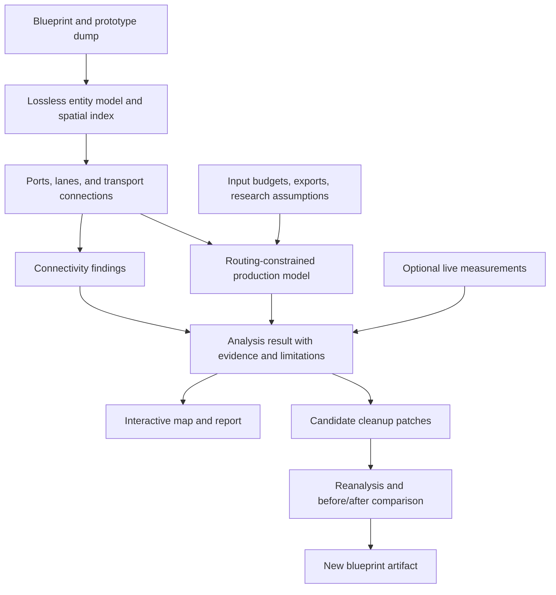

# Blueprint routing analysis and design cleanup

Status: design reference; the first routing pipeline is implemented with a
conditional audit pass. Game validation and real-pilot acceptance remain open.
Design date: 2026-09-08; status updated: 2026-09-11.
See [current implementation status](blueprint-routing-prompts/NEXT-STEPS.md)
and the [next-run checklist](blueprint-routing-next-run.md). Later phases below
remain proposals; this document alone is not evidence that a feature exists.

## Revised implementation direction — 2026-09-11

Prioritize a useful deterministic throughput workflow: designate full input belts
in the page, preserve existing assembler recipes, infer furnaces where supported,
and evaluate sustained flow. Retain the CLI for import and analysis. Keep
optimistic bounds distinct from operating predictions and measured rates.
Efficient and aesthetic layout optimization follows a validated evaluator.
See the [deterministic roadmap](blueprint-routing-deterministic-roadmap.md) for
scope, reuse evaluation and acceptance criteria. It supersedes the original
phase ordering where explicitly stated.

## Purpose

Extend Factoribot from recipe-level capacity calculations to analysis of the
physical factory represented by a blueprint. Explain whether production is
limited by machines, delivery routes, input budgets, or unsupported mechanics,
and produce concrete, reviewable layout improvements.

The motivating case is a purple-science factory whose owner added circuit
assemblers after observing shortages. The current analyzer reports sufficient
aggregate circuit capacity but cannot establish whether those machines can
deliver their output to the consumers that need it. The cause of the original
sizing discrepancy remains unresolved. Neither additional installed machines nor
backed-up belts alone establish sustained production or a solver error.

The intended experience is: import a blueprint, identify its supplies and desired
exports, inspect a map with findings, compare proposed changes, and export a new
blueprint when a change is worth making.

## Original implementation baseline and gaps (2026-09-08)

- `daemon/factoribot/blueprint.py` decodes full entity records, then
  `summarize_blueprint` groups machines by recipe, machine type, and modules.
  The summary discards position, direction, connectivity, and individual identity.
- `bpanalyze.py` calculates recipe-stage craft capacity and scales production to
  the tightest stage. It treats missing upstream recipes as external supplies.
  Recipe-less furnaces are counted but excluded from the production model.
- `planner.py` enforces explicit input budgets and net exports, but assumes
  materials can move freely between producers and consumers.
- `model.py` and `gamedata.py` normalize recipes and machine speeds, but do not
  provide the spatial and transport properties needed for routing analysis.
- `tools.py` and `mcp_server.py` expose deterministic tools. MCP currently performs
  calculations without modifying files or placing entities in the game.

There are also existing correctness issues to address before extending the
analysis. The legacy solver accepts unused machine-option keys and can fall back
to AM3 despite an intended AM2 setting; the planner rejects such unused keys.
Legacy reports display craft rates under ambiguous `/s` labels, and blueprint
`capacity_per_s` is crafts/s rather than output items/s. These are confirmed
failure paths, not a confirmed explanation of the original factory discrepancy.

## Scope and claim boundaries

| Capability | Intended result | Qualification |
| --- | --- | --- |
| Connectivity | Trace belts, undergrounds, splitters, inserters, and machine ports | Exact for supported, tested entity mechanics |
| Lane routing | Track possible item paths on each lane, including filters and priorities | Unknown item feeds and control conditions remain explicit |
| Delivery capacity | Compare local demand with shared route capacity | Initially an optimistic steady-state upper bound |
| Inserters | Check pickup/drop endpoints, filters, and transfer limits | Capacity depends on research, endpoints, and validated timing models |
| Smelting | Include steel and brick production in material accounting | Infer recipes only when feed evidence is unambiguous |
| Power | Check coverage and network connectivity; estimate connected loads | Blueprint presence does not prove a powered live network |
| Beacons | Derive effects from actual positions and installed modules | Requires versioned coverage/effect rules and quality support |
| Cleanup | Propose local simplifications with quantified tradeoffs | Connectivity preservation alone does not prove equivalent operation |
| Live comparison | Compare predicted rates with observed rates and inventories | Separate optional game-export feature |

The initial release does not simulate individual items, trains, fluid dynamics,
logistic bots, or arbitrary circuit-network programs. Such entities remain on the
map and in exports. Unsupported mechanics must never become invisible free
transport or unlimited supply.

## Architecture

Preserve the existing aggregate analyzer for compatibility. Add a spatial model
alongside it and a separate detailed analysis entry point.



Proposed ownership:

| Module | Responsibility |
| --- | --- |
| `spatial.py` | Individual entities, geometry, spatial lookup, boundary ports |
| `transport.py` | Versioned belt/lane, underground, splitter, and inserter rules |
| `routing.py` | Reachability, shared capacity constraints, item-path evidence |
| `blueprint_plan.py` | Couple spatial transport to recipe activities and budgets |
| `findings.py` | Stable finding schema, evidence, severity, and uncertainty |
| `blueprint_cleanup.py` | Candidate patches, preconditions, and validation |
| `blueprint_view.py` | Map/report artifacts from analysis data |

Extend `gamedata.py`/`model.py` for normalized spatial prototype properties and
reuse recipe and module calculations from `solver.py`. Avoid a second recipe
database or duplicated production arithmetic. Exact module boundaries can change
during implementation; the separation of evidence, mechanics, solving, and
presentation should remain.

## Spatial and transport model

### Lossless entities and prototypes

Retain the original entity records, blueprint metadata, book selection, wires,
tiles, schedules, tags, filters, and unknown fields. Normalize analysis fields
without rebuilding the entire blueprint from a reduced representation.

Identify an entity by blueprint index and `entity_number`. Record its position,
orientation, footprint, quality, recipe, modules, and relevant control settings.
Use prototype-derived collision/selection geometry where appropriate, not a
universal one-tile assumption. Keep coordinates at their original precision.

Add versioned transport metadata: supported directions, underground reach,
splitter geometry, inserter pickup/drop locations and timing properties, pole
coverage/wire reach, and beacon geometry/effects. Validate these against pinned
game-version fixtures. The existing normalized dump is insufficient by itself
for every mechanic; runtime semantics need explicit adapters and evidence.

Bound input size, decompression, entity count, and analysis work. Use spatial
hashing or another local-neighbor index instead of all-pairs geometry checks.
Return a structured limit or unsupported result when analysis cannot complete.

### Ports, lanes, and boundaries

Represent each belt segment with lane-specific incoming and outgoing ports.
Represent underground links as paired endpoints with lane mapping. Splitters
have distinct input/output lanes and explicit filtering, priority, and shared
capacity constraints. Inserters connect concrete pickup and drop locations to
belts, inventories, or machine ports.

An edge records direction, item eligibility, capacity evidence, and whether its
semantics are exact, conditional, or relaxed. An inserter's endpoints may be known
while its rate remains unknown; report those as separate facts.

Detect candidate external ports, but require an explicit supply mapping before
budget-constrained throughput claims. A blueprint edge is not automatically a
source or a fault: it may connect to another factory block. Explicitly declared
interior sources, such as a train unloading area, are also valid boundaries.

Input budgets are global by item and allocated across named ports. Mapping two
ports to a 60/s iron budget must not accidentally provide 60/s at each port. State
which lanes carry which items; an item budget does not establish its location.

### Connectivity and item eligibility

Start with physical reachability. Propagate possible item identities from declared
feeds and recipe outputs through supported connections. Preserve ambiguity rather
than arbitrarily assigning a single item to a mixed belt.

Findings include disconnected internal endpoints, reversed connections,
unmatched undergrounds, unreachable recipe ingredients, blocked output routes,
and incompatible filters. A proposed mixed-item route may be structurally possible
but unable to maintain the desired arrangement; label it accordingly.

Circuit-controlled entities are conditional unless their state can be resolved
under explicit assumptions. Do not evaluate arbitrary circuits as always enabled.
Rail and fluid entities are initially treated as declared boundaries or unsupported
subsystems, not inferred infinite-throughput links.

## Coupling routes and production

The existing planner uses one shared material pool per item. The spatial planner
must instead balance material at local ports or connected components.

Use nonnegative variables for recipe crafts/s at each machine or provably
equivalent group, item flows through transport edges, imports, and net exports.
Enforce:

1. Local material conservation, including recipe consumption and production.
2. Machine craft capacity using explicit machine/module/beacon assumptions.
3. Shared lane, splitter, and inserter capacities across all carried items.
4. Item eligibility and declared boundary locations.
5. Global input budgets and every requested net export.

For a shared edge, `sum(item_flow) <= edge_capacity`; each item must not receive
the full edge capacity independently. Recipes remain in crafts/s, while material
flows are in items/s or fluid units/s. Production yield is applied explicitly.

Begin with reachability plus a continuous flow relaxation. It can prove that a
route is insufficient when even its optimistic capacity cannot meet demand.
Feasibility of that relaxation does **not** prove the game will achieve the rate:
splitter scheduling, priority behavior, item ordering, inserter timing, and
backpressure can make an apparently feasible allocation unrealizable.

Return three separate quantities where supported:

- Aggregate machine-capacity bound with freely deliverable inputs.
- Bound after the declared global input budgets are enforced.
- Bound after supported routing constraints are also enforced.

These are nested only when recipe scope, boundaries, and assumptions match.
Never compare a smelting-excluded aggregate result with a full input-budget
result as though only routing changed. Do not label an optimistic bound
“achievable throughput.” A guaranteed positive lower bound requires a validated
execution model or a separately justified operating schedule.

Explain bottlenecks with local demand, route capacity, and an evidence path or
capacity cut. A tight LP constraint alone does not prove that expanding it improves
output; rerun the changed scenario before making that claim.

## Smelting, power, and beacons

Infer a furnace recipe only when supported possible feeds identify a unique
compatible recipe. Otherwise report candidates and accept an explicit per-entity
or per-block assignment. An unknown furnace must not silently disappear from the
model or turn its output into a free external supply.

For poles, distinguish footprint coverage, network connectivity, and sufficient
generation. Preserve exported copper-wire connections; use documented placement
rules only where a connection is absent and inference is justified. A network
with no visible generator may legitimately receive external power.

For beacons, calculate affected machines from actual geometry and supported
version/quality rules, then reuse the shared effect calculations. Include beacon
and idle infrastructure power only when their behavior has been modeled. Research,
quality, control state, and external power are explicit assumptions, not facts
inferred from the existence of a prototype.

## Findings, map, and tool contract

Every result carries the blueprint hash, prototype-data hash, schema/analyzer
versions, interpreted request, assumptions, and unsupported mechanics. Findings
have stable IDs and a structure such as:

```json
{
  "code": "route_capacity_insufficient",
  "severity": "warning",
  "evidence_kind": "upper_bound",
  "entity_ids": [101, 102],
  "item": "electronic-circuit",
  "required_items_per_s": 10,
  "capacity_upper_bound_items_per_s": 7.5,
  "assumptions": ["declared source and lane assignment"],
  "message": "The identified feed cannot deliver the requested circuit rate."
}
```

This is an illustrative schema, not a finding about the user's blueprint.
Separate severity from evidence: `structural`, `upper_bound`, `estimated`,
`conditional`, and `observed` do not mean the same thing.

The viewer provides pan/zoom, item-colored routes, selectable machine blocks,
required/capacity overlays, a findings list, and before/after comparison. Selecting
a finding highlights its entities and evidence path. Show uncertainty explicitly;
never color a machine as currently starved without live evidence. Render labels
and descriptions as untrusted text rather than executable HTML or instructions.

Proposed MCP tools, introduced incrementally:

- `inspect_blueprint_layout`: inventory, boundary candidates, supported mechanics,
  connectivity findings, and compact spatial data.
- `analyze_blueprint_routes`: explicit budgets, boundary feeds, exports, and
  assumptions; returns route and production bounds plus findings.
- `propose_blueprint_cleanup`: objective, protected entities/ports/areas, edit
  budget, and baseline analysis; returns candidate patches and comparisons.
- `transform_blueprint`: original blueprint plus a reviewed patch; returns a new
  blueprint string and validation report without placing it in the game.

Keep pure calculations compatible with read-only MCP annotations. Let the host
write/open map and blueprint artifacts in the workspace; file creation or live
game placement must not hide inside a read-only analysis call. For large results,
return compact summaries with paginated detail or scoped analysis requests rather
than forcing the entire transport graph into the conversation.

## Design cleanup and edit validation

Generate small candidate edits before attempting global redesign. Candidates can
remove confirmed unused internal branches, shorten detours, simplify crossings,
adjust splitter settings, or relocate supply routes. Report footprint, belt length,
entity cost, capacity bounds, and changed interfaces for each candidate. Aesthetic
preferences and material cost are separate objectives; there is no universal
“cleanest” layout.

Protect boundary ports, user-selected entities, expansion areas, wiring, and
unknown mechanics by default. A dead-looking branch may be an expansion stub or
buffer. Require enough evidence to distinguish unused topology from intentional
reserve space before proposing its removal as an improvement.

Each patch has a baseline hash, entity-level preconditions, affected IDs, explicit
operations, and an inverse. Preserve unaffected records and unknown fields. Allocate
new IDs without collisions and rewrite affected references consistently. Reject a
patch against a changed blueprint instead of applying it approximately.

Validation includes serialization round-trip, collision/footprint checks, wiring
and endpoint integrity, preserved boundaries, supported routing semantics, and
reanalysis under the same budgets and exports. Do not claim equal performance
solely because two optimistic bounds match. Changes involving unvalidated ordering,
priority, timing, or buffer behavior remain experimental and need game validation.

Export a separate artifact with a readable change list. Keep analysis and local
artifact generation distinct from applying changes to a live save.

## Implementation milestones and acceptance gates

| Phase | Deliverable | Acceptance gate |
| --- | --- | --- |
| 0 — Calculation trust | Consistent option validation, explicit units and machine defaults, replayable requests | Invalid machine keys fail across legacy and planner tools; multi-result recipes report crafts and items distinctly; belt-budget case matches independent recipe arithmetic |
| 1 — Spatial foundation | Lossless entity model, prototype adapters, spatial index, basic map | Round-trip preserves unknown fields; direction/footprint tests pass; book selection is explicit; unsupported entities remain visible |
| 2 — Connectivity | Lanes, underground pairing, splitters, inserter endpoints, boundary declarations | Small game-validated fixtures cover each supported interaction and detect broken connections without flagging declared interfaces |
| 3 — Delivery bounds | Local material balances, shared capacities, global budgets, evidence paths | A disconnected producer cannot feed a consumer; competing items share capacity; relaxing route constraints recovers the matching aggregate bound |
| 4 — Broader mechanics | Furnace assignments/inference, inserter capacity estimates, power coverage, positional beacons | Ambiguities remain explicit; research assumptions change results predictably; beacon and power cases match pinned reference fixtures |
| 5 — Cleanup proposals | Protected interfaces, bounded local patches, before/after viewer, export | Patch/inverse round-trip works; unrelated metadata survives; collisions and stale baselines fail; performance claims respect model fidelity |
| 6 — Live validation | Optional game export of rates, inventories, and machine status | Measurements identify tick interval, scope, research, and inventory change; repeated runs can confirm or falsify predictions |

Phases are incremental releases, not a single large rewrite. Phase 0 precedes new
numerical claims. Phase 1 provides the viewer foundation; phases 2–3 add the first
useful routing audit. Phase 4 contains separable extensions. Phase 5 depends on
the relevant transport rules and phase 6 is required for claims beyond the static
model's validated scope. No calendar estimates are committed before phase 1
establishes mechanics coverage and performance.

The first usable release should import the motivating blueprint, show its circuit,
furnace, rail, and science blocks, let the owner assign input ports, and explain
structural delivery problems with precise locations. It need not automatically
redesign the factory to be valuable.

## Validation strategy

Use three independent layers of evidence:

1. Hand-solvable synthetic factories test conservation, machine capacity,
   recipe yield, net exports, and shared bottleneck capacities.
2. Small pinned game-export fixtures test actual lane, side-loading, splitter,
   underground, inserter, beacon, and control behavior. Record game/mod versions,
   setup, expected behavior, and how it was observed. Do not derive expected
   routing behavior from the implementation being tested.
3. Large real blueprints test integration, unsupported-mechanic reporting,
   performance, and useful diagnostics. They are not automatically ground truth
   for achievable throughput.

Counterexamples must include a half-belt shared feed, a disconnected circuit
producer, competing items on one lane, a filtered/priority splitter, an underground
pairing conflict, a disabled inserter, an ambiguous smelting feed, multiple ports
sharing one global budget, and an output blocked by a missing route. Add translation
and supported rotation invariance, deterministic finding order, and patch/inverse
properties. Increasing a supply ceiling must not reduce the optimal value under
an otherwise identical model.

Preserve the motivating request as a regression scenario: 30 stone/s, 30 copper
plates/s, 30 plastic/s, 60 iron plates/s, AM2, no modules, purple-science net
export, with steel/bricks made internally. For the currently loaded canonical
recipes the budget-only model predicts 8/7 science/s. Treat that as a stated
mathematical expectation to check independently, not proof that the live factory
or original specification has been explained. Add separate scenarios with explicit
intermediate exports and with declared external steel to catch scope changes.

Run focused tests during each phase and `make test` before completion. Exercise
schemas and results through the real stdio MCP interface as well as Python.
Benchmark the supplied multi-thousand-entity blueprint; record baseline latency,
memory, and entity/edge counts before setting enforced performance budgets.

## Decisions and follow-up work

- Keep current aggregate analysis available and explicitly labeled; do not quietly
  change its input semantics when spatial analysis ships.
- Use static upper bounds before attempting a full item simulation. If fixtures
  show that a mechanic cannot be represented faithfully, expose the relaxation or
  leave that mechanic unsupported.
- Require explicit boundary feeds and shared budgets for constrained claims.
- Keep recipe and machine-option validation shared across tools; the host must
  retain the complete prior request when changing one constraint.
- Start cleanup with local candidates and protected interfaces. Defer global
  placement optimization, train scheduling, fluid simulation, and unrestricted
  circuit interpretation.
- Add live measurements through a separate mod/export design. The existing
  proposed chat bridge is not a telemetry implementation.
- During phase 1, pin the supported game versions, available geometry fields,
  first transport entity set, and reference-fixture acquisition workflow. Until
  those are established, avoid claims of general mod or quality support.

Completion means the system can explain a concrete layout constraint, identify
the affected entities and assumptions, and demonstrate what a proposed change
does under a reproducible model. A plausible diagram or another aggregate machine
table is not sufficient validation of routing behavior.
